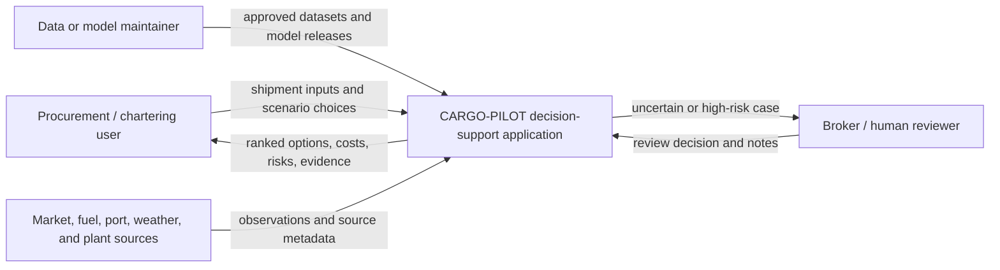
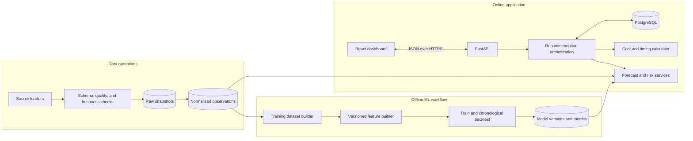
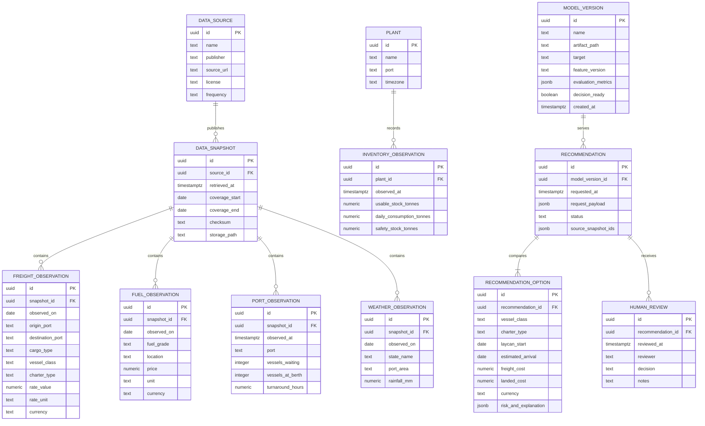
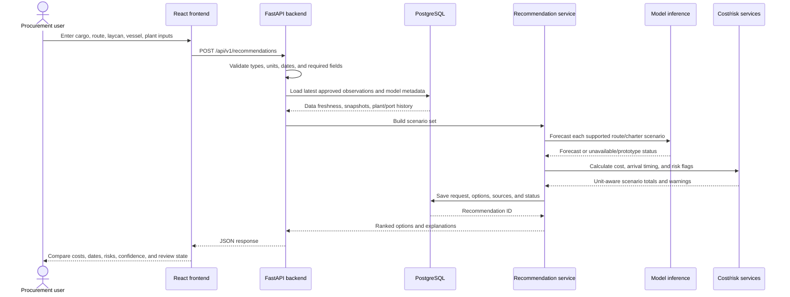
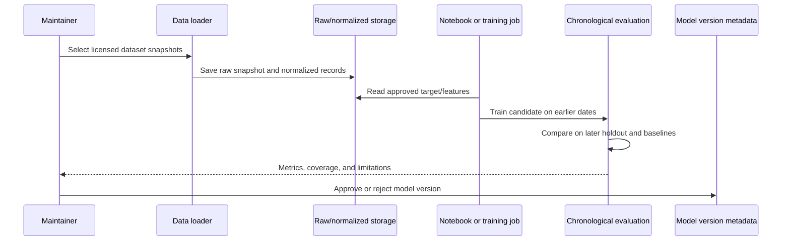
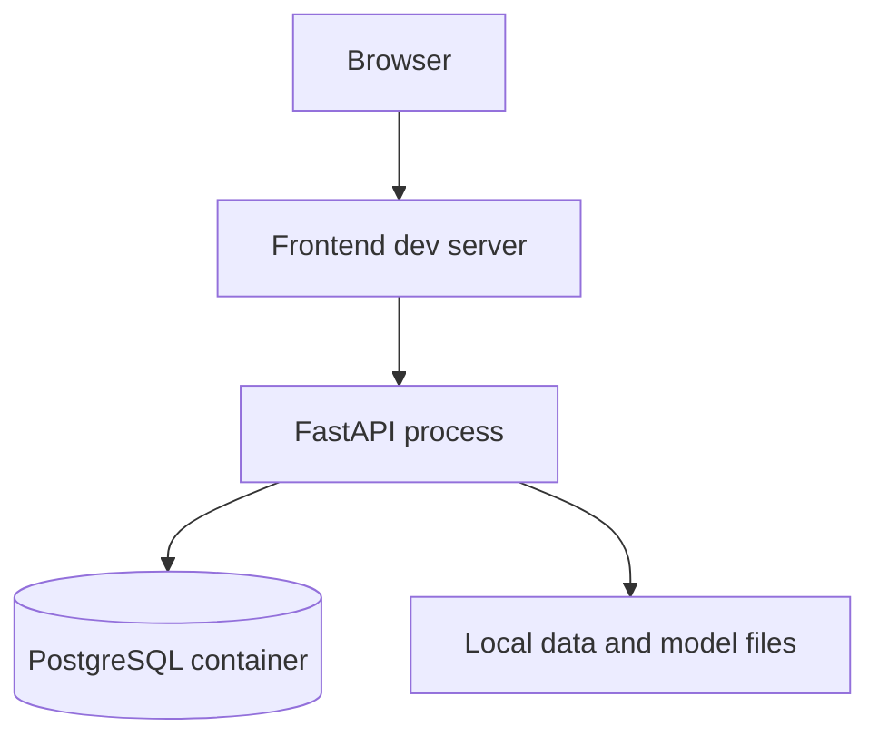
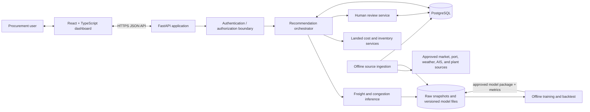

# CARGO-PILOT: end-to-end architecture

## 1. Purpose and status

CARGO-PILOT is a decision-support system for dry-bulk procurement teams bringing cargo into East Coast India. It should help compare vessel and charter options, forecast freight, estimate arrival and port risk, calculate landed cost, and align arrival timing with plant inventory.

This is the proposed architecture for the complete product. The current workspace contains the React/Vite frontend, FastAPI backend, and ML models separated into modular directories (`frontend/`, `backend/`, `ml/`, and `tests/`). The production database is **not implemented yet**.

The BDI ML artifact is a pipeline prototype. It uses global BDI history through March 2009 rather than India-route charter labels, and its gradient-boosting candidate loses to persistence on the saved time-based holdout. A separate next-hour congestion demo uses seven days of NOAA AIS from a U.S. port area and a rule-based target derived from vessel behavior. Neither artifact is a validated India-port model. The system must expose these model/data limits and avoid presenting either as a reliable procurement forecast.

## 2. Product requirements that shape the design

The system needs to support:

- Freight forecasts by cargo, origin, destination, vessel class, charter type, cargo size, and laycan.
- Vessel-class and booking-window comparisons.
- Port congestion and demurrage risk estimates before a charter is confirmed.
- Landed-cost comparison across alternatives.
- Arrival timing based on stock, consumption, and safety-stock targets.
- Confidence, evidence freshness, key factors, and human-review escalation.
- An end-to-end data path from source ingestion through model output to an explainable user decision.

Product rules:

1. A global market proxy must not be labeled as a route quote.
2. Missing data must produce an explicit unavailable or review state, never a fabricated precise estimate.
3. Observations, model predictions, user inputs, and illustrative assumptions must remain distinguishable.
4. Costs must retain units, currency, and calculation assumptions.
5. Forecast validation must use chronological splits and compare with simple baselines.

## 3. Recommended technology choices

| Layer | Recommended prototype choice | Why |
|---|---|---|
| Frontend | React + TypeScript + Vite | Fast dashboard development and typed API contracts. |
| Backend | Python + FastAPI + Pydantic | Python shares the ML runtime; Pydantic validates requests and responses. |
| ML | scikit-learn, pandas, NumPy, xarray, joblib, XGBoost, LightGBM | Supports the existing BDI notebook and the separate AIS/weather comparison demo. |
| Database | PostgreSQL | Relational records for source history, observations, scenarios, reviews, and audit data. |
| Local development | Docker Compose for API + PostgreSQL; frontend can run with Vite | Reproducible setup without introducing extra services. |
| File storage | Local `data/` directory in development; object storage later | Raw snapshots and model files should not be stored as database blobs. |

Redis, queues, a feature store, Kubernetes, and microservices are not needed for the first demonstrator. Add them only when actual volume or deployment requirements justify the extra operations.

## 4. High-level architecture

### 4.1 System context



### 4.2 Logical components



Data preparation and model training are offline jobs. The online API loads one approved model version and serves bounded predictions. A notebook can remain the hackathon training interface; a repeatable training script or job can be added later without changing the API contract.

## 5. Low-level component design

### 5.1 Frontend

The frontend is a user interface only. It collects inputs, displays results, and sends requests to the API. It must not independently implement model features or landed-cost rules.

#### Screens

1. **Shipment setup**
   - Cargo type and quantity in metric tonnes.
   - Loading origin and destination port.
   - Laycan start/end dates.
   - Allowed vessel classes and charter type.
   - Plant, current usable stock, daily consumption, and safety-stock target.
   - Optional user-supplied insurance, port charges, bunker assumptions, laytime, and demurrage rate.

2. **Scenario comparison**
   - One row/card per vessel/charter/timing option.
   - Expected freight estimate and unit.
   - Fuel, insurance, port charge, projected demurrage, and total landed cost.
   - Estimated arrival date and stock coverage at arrival.
   - Congestion risk and confidence state.
   - Data freshness and sources used.

3. **Recommendation detail**
   - Why the option ranks where it does.
   - Cost assumptions and formulas.
   - Forecast range and model version.
   - Missing or stale inputs.
   - Human-review status and reviewer notes.

4. **Data/model status**
   - Last successful refresh per data source.
   - Dataset date coverage and license metadata.
   - Active model version, target, evaluation date, and baseline comparison.
   - A visible prototype/unavailable status when route-level data are insufficient.

#### Frontend modules

```text
src/
├── api/              # Typed HTTP client and API response types
├── components/       # Form fields, cards, tables, risk badge, charts
├── pages/            # Shipment form, comparison, detail, status pages
├── validation/       # Client-side convenience validation (server validates too)
└── app/              # Routing and application shell
```

Frontend validation improves usability but is not trusted as the security or business validation boundary. The backend validates every request again.

### 5.2 Backend API

The backend owns input validation, data access, model loading, feature generation, costs, risk policy, ranking, and audit records.

Suggested modules:

```text
backend/app/
├── main.py                 # FastAPI creation and route registration
├── api/                    # HTTP endpoints and request/response schemas
├── services/
│   ├── recommendation.py   # Orchestrates forecasts, costs, risk, ranking
│   ├── freight.py          # Route-rate prediction and data-coverage checks
│   ├── congestion.py       # Port waiting and demurrage estimate
│   ├── landed_cost.py      # Unit-aware cost calculations
│   └── inventory.py       # Stock cover and arrival timing
├── ml/
│   ├── loader.py           # Loads approved model version
│   ├── features.py         # Same feature logic used during training
│   └── inference.py        # Validates model inputs and formats predictions
├── repositories/           # Database queries
├── models/                 # Database ORM models
└── settings.py             # Environment-based config
```

Keep HTTP routes thin. Routes parse requests and invoke services; business calculations belong in services, not route handlers.

#### Proposed endpoints

| Method and path | Purpose |
|---|---|
| `GET /health` | Service health and API version. |
| `GET /api/v1/metadata` | Supported ports, cargo, vessel classes, units, and data status. |
| `POST /api/v1/forecasts/freight` | Forecast freight for one route/charter request. |
| `POST /api/v1/recommendations` | Generate and rank cost/timing alternatives. |
| `GET /api/v1/recommendations/{id}` | Retrieve a saved recommendation and audit detail. |
| `POST /api/v1/recommendations/{id}/review` | Record a human review outcome and notes. |
| `GET /api/v1/data-status` | Return source freshness, coverage, and model readiness. |

#### Example recommendation request

```json
{
  "cargo": {
    "type": "coal",
    "quantity_tonnes": 60000
  },
  "route": {
    "origin_port": "Samarinda",
    "destination_port": "Paradip"
  },
  "laycan": {
    "start": "2026-11-10",
    "end": "2026-11-20"
  },
  "charter_preferences": {
    "types": ["voyage"],
    "vessel_classes": ["Panamax", "Supramax"]
  },
  "plant": {
    "id": "plant-001",
    "usable_stock_tonnes": 180000,
    "daily_consumption_tonnes": 9000,
    "safety_stock_tonnes": 45000
  },
  "cost_inputs": {
    "insurance_usd_per_tonne": null,
    "port_charges_usd": null,
    "demurrage_usd_per_day": null
  }
}
```

#### Example recommendation response

```json
{
  "recommendation_id": "rec-uuid",
  "status": "review_required",
  "model_status": "prototype_only",
  "ranked_options": [],
  "reason_codes": ["NO_VALIDATED_ROUTE_RATE_HISTORY"],
  "data_as_of": {},
  "model_version": null
}
```

An empty `ranked_options` list is valid when the system cannot support a defensible prediction. Do not return fabricated precision to make the screen look complete.

#### API status and errors

- `400`: invalid request values or unsupported units.
- `404`: unknown saved recommendation or plant.
- `409`: request cannot be evaluated with current model/data state.
- `422`: schema validation failure.
- `503`: required model or data source unavailable.

Every response should include a request ID. Error bodies should identify a safe, human-readable reason without exposing credentials, filesystem paths, or raw stack traces.

### 5.3 ML training and serving

#### Current training flow

1. Read BDI, Brent, and rainfall CSVs from `ml/data/raw/`.
2. Parse dates/numeric fields and inspect date ranges.
3. Join Brent backward to BDI observations so the model never sees a future oil price.
4. Build BDI lags, rolling statistics, percentage changes, Brent lag/change values, and day-of-year encoding.
5. Define a five-observation-ahead BDI target.
6. Use an 80/20 chronological split with no shuffling.
7. Train `HistGradientBoostingRegressor`.
8. Compare against persistence, where the future BDI is predicted as the current BDI.
9. Save the candidate artifact and evaluation report.

Rainfall is loaded, cleaned, filtered to Odisha, West Bengal, Andhra Pradesh, and Tamil Nadu, but excluded from this model because its available overlap with the old BDI series is too short.

#### Current results and restrictions

The report in `ml/results.json` records:

- Candidate MAE: about 1,312.77 BDI points.
- Persistence MAE: about 251.27 BDI points.
- Candidate did not beat the baseline.
- BDI target ends in 2009 and is global, not an India route quote.

The current model must therefore be treated as a notebook demonstration only. The API should check model metadata before inference. If `recommended_for_decision_use` is false, return a prototype status and do not create a high-confidence charter recommendation from it.

#### Separate AIS congestion demo

`ml/ais_congestion_training.ipynb` implements the proposed AIS flow on a small seven-day NOAA sample. It filters to a bounding box around San Pedro Bay / Los Angeles, aggregates hourly vessel count, average speed, and stationary ratio, joins hourly wind/gust from NOAA Pier J and wave/water-temperature observations from nearby NDBC buoy 46253, builds lag/rolling/time features, and predicts a rule-based congestion index one hour ahead. Weather values are aligned by UTC hour. Its chronological holdout has 114 training rows and 29 test rows. In the current weather-enabled run, Linear Regression scores MAE 0.685 and RMSE 0.854 index points; persistence scores MAE 0.679. The weather-enabled candidate therefore does not beat the baseline. The previous AIS-only candidate scored MAE 0.545 on this same very small holdout, so this experiment does not show a benefit from adding weather. The index is engineered from AIS behavior and is not observed port waiting time, congestion ground truth, or demurrage.

This is a hackathon workflow demonstration only: NOAA AIS is U.S.-focused, the sample covers one week, and the holdout is small. Do not use this artifact to predict congestion at Paradip, Visakhapatnam, Haldia, or Chennai. An India-port model needs India-port AIS and operational arrival/berth/departure outcomes. The demo artifact and metrics are `ml/models/ais_congestion_demo.joblib` and `ml/ais_congestion_results.json`.

#### Training/serving consistency

The current artifact contains a fitted estimator, ordered feature-column names, and prediction horizon. A serving implementation must:

- Reuse the same feature-generation code as training.
- Reject missing required features instead of silently substituting arbitrary values.
- Preserve units, observation timestamps, and feature availability time.
- Record model version, source snapshot IDs, feature version, prediction time, and output.
- Keep training and test periods chronological.
- Re-evaluate against persistence and seasonal-naive baselines whenever the target data changes.

The current notebook does not provide a complete production inference API or uncertainty calibration. These are backend/ML integration tasks.

### 5.4 Recommendation and business calculation services

Forecasting produces estimates; deterministic services compute costs and timing from explicit inputs.

#### Landed cost

For a voyage charter, the simplified expression is:

```text
landed_cost_usd = freight_usd
                + bunker_or_fuel_usd
                + insurance_usd
                + origin_port_charges_usd
                + destination_port_charges_usd
                + projected_demurrage_usd
```

All inputs need compatible units. For a rate quoted in USD/tonne:

```text
freight_usd = freight_usd_per_tonne * cargo_quantity_tonnes
```

A time-charter quote in USD/day cannot be compared directly to USD/tonne. The service must model duration, fuel consumption, and contractual responsibility before comparing that option.

#### Demurrage and congestion

Where actual arrival/wait/discharge history exists, estimate waiting time by port and vessel class, then combine with laytime allowance and demurrage rate:

```text
demurrage_usd = max(0, estimated_wait_and_discharge_days - allowed_laytime_days)
                * demurrage_usd_per_day
```

Without historical labels, use a clearly labeled scenario/rule rather than claiming an ML risk probability. Port vessel counts or state rainfall by themselves are not demurrage outcomes.

#### Inventory timing

```text
days_of_cover = usable_stock_tonnes / daily_consumption_tonnes
```

Use stock and consumption from the receiving plant. Compare expected arrival against safety stock and reorder thresholds. Protect against zero/negative consumption and missing inventory by returning an unavailable timing recommendation.

#### Ranking

Do not hard-code arbitrary weights for cost, lateness, and risk without procurement input. Initial prototype can show a cost-sorted comparison plus separate risk and inventory flags. A composite score can be introduced later with documented business-approved weights.

### 5.5 Database

Use PostgreSQL for structured observations and application records. Keep raw CSVs and serialized model files in file/object storage and store their paths/checksums in the database.

#### Entity relationship diagram



#### Database rules

- Store event times as timezone-aware timestamps; store business dates separately where appropriate.
- Store numeric value and unit/currency in separate fields.
- Preserve source snapshot IDs for traceability.
- Add indexes on observation date, origin/destination, port, vessel class, and recommendation ID.
- Add uniqueness rules only where the source semantics support them; multiple quote observations can be legitimate.
- Keep user/plant data access-controlled and auditable.
- Do not overwrite raw historical records silently. Store corrections or refreshed snapshots with provenance.

### 5.6 Source ingestion and validation

The first version can use a notebook/manual refresh. The eventual backend should separate ingestion from serving.

Each loader should:

1. Read a source URL or approved local file.
2. Record publisher, license, retrieval time, date coverage, and checksum.
3. Validate required columns, parse dates, enforce units, and report missing/duplicate rows.
4. Save the unmodified file as a raw snapshot.
5. Normalize to canonical observation tables.
6. Mark data stale or incomplete when expected refreshes do not arrive.

Use only data sources whose licensing and terms have been checked. Candidate Kaggle datasets are not automatically licensed for product use just because they can be downloaded.

### 5.7 Human review and audit

Use explicit recommendation states:

- `available`: data and model pass configured readiness checks.
- `review_required`: uncertain/high-risk case or missing evidence.
- `unavailable`: no defensible forecast can be produced.
- `prototype_only`: current model/data combination is for demonstration.

For every recommendation, store request inputs, model version, data snapshots, outputs, explanation factors, review status, and final human decision. A reviewer correction should not silently become a training label; it must be captured as a sourced observation with its own quality review.

## 6. End-to-end sequences

### 6.1 User requests options



### 6.2 Offline model release



## 7. Confidence, explainability, and safety behavior

Confidence should be based on observed historical performance and data support, not a decorative percentage. Inputs to a future confidence policy may include:

- Route/cargo/vessel similarity to the training examples.
- Age and completeness of the relevant freight observations.
- Backtest error for that route/class/horizon.
- Whether bunker and port inputs are observed, proxied, or missing.
- Spread between scenarios or ensemble members.
- Whether the recommendation is extrapolating beyond observed ranges.

For the current model, confidence should be `unavailable` or `prototype_only` for procurement decisions. The current evaluation has no calibrated prediction interval and no route-specific backtest.

Explainability should show:

- Main recent historical values and trends used.
- The selected route/vessel assumptions.
- Cost components and formulas.
- Data source and as-of date for each input.
- Reasons for review/unavailability.

## 8. Deployment architecture

### 8.1 Local hackathon setup



Use environment variables for database URL, model directory, API origin, and mode. Do not commit `.env`, raw paid data, credentials, or proprietary quotes.

### 8.2 Later hosted setup

- Static frontend hosted behind HTTPS.
- Backend container hosted as one API service.
- Managed PostgreSQL with backups.
- Object storage for approved raw snapshots and model artifacts.
- Scheduled ingestion/training job kept separate from the online API process.
- Central logs and alerts for API errors, stale feeds, and model-load failures.

Begin with one backend deployment and one database. Split services only when independent scaling or ownership is needed.

## 9. Operational and security requirements

- Validate request payloads on the server and set upper limits on cargo quantity and time windows.
- Use HTTPS in deployment and authentication for plant-specific inventory data.
- Apply role-based access if users can view or edit different plants or procurement records.
- Keep credentials in environment/secret storage, never in notebooks or committed files.
- Log request IDs, model version, source IDs, status, and timing; avoid unnecessary personal or commercially sensitive values in logs.
- Add database migrations and backups before persistent operational use.
- Expose `/health` and `/api/v1/data-status` without returning secrets.
- Have a clear stale-data path: return warning/unavailable state and escalate instead of using arbitrarily old observations.

## 10. Development system design: HLD and LLD

This section turns the product architecture into a buildable system design. It describes the target application the team should develop, while keeping current status clear: this workspace currently contains ML notebooks, reports, and documentation; the API, dashboard, and database have not yet been implemented.

### 10.1 High-level design (HLD)

#### System boundary and responsibilities

CARGO-PILOT is a modular web application with one browser client, one Python API, one relational database, and a separate offline data/model workflow. The API is the trusted application boundary: it validates user input, checks data/model readiness, orchestrates calculations, persists decisions, and returns explainable results. The browser formats data and collects inputs; it does not calculate recommendations or invoke model artifacts directly.



#### HLD data paths

1. **Offline data path:** approved source files are captured as immutable snapshots with source, license, retrieval time, date coverage, and checksum. Loaders validate schemas and units, then normalize observations into PostgreSQL. Failed quality checks quarantine a snapshot instead of publishing malformed rows.
2. **Offline ML path:** a training job reads a dated set of normalized observations, builds versioned features, performs chronological evaluation against simple baselines, and writes an artifact plus a manifest. A maintainer approves or rejects the release. Training is never triggered by a browser request.
3. **Online decision path:** the UI sends shipment and plant inputs to the API. The API validates them, fetches eligible observations and model metadata, creates comparable charter scenarios, calculates forecasts and deterministic costs, applies readiness/risk rules, saves an audit record, and returns options or an explicit unavailable/review result.
4. **Review path:** uncertain, high-risk, or prototype-only cases are marked for review. Reviewer decisions are stored separately from source observations and cannot silently become ML labels.

#### Deployable units and ownership

| Deployable unit | Owns | Reads | Writes |
|---|---|---|---|
| Web dashboard | Forms, comparison views, evidence display, review actions | API responses | User requests through API |
| API service | Validation, orchestration, inference, calculation, audit | PostgreSQL and approved model files | Recommendations, options, review records |
| PostgreSQL | Canonical observations and application records | Ingestion jobs and API | Source snapshots, inventory, model metadata, recommendations |
| Ingestion/training job | Source refresh, quality checks, feature build, backtest, artifact packaging | Approved external sources and database | Raw/object storage, normalized observations, model manifest |
| File/object storage | Immutable raw snapshots and model artifacts | Ingestion/training | Versioned snapshots and release packages |

For the hackathon, the API can run as one modular monolith and ingestion/training can run manually from notebooks/scripts. Avoid microservices, queues, and feature-store infrastructure until scale or separate ownership requires them.

#### HLD runtime decisions

- **Synchronous recommendation request:** suitable for the initial small scenario set. Set request and database timeouts; if future workloads exceed the HTTP budget, move scenario generation to a job queue and return a job ID.
- **One model package per model version:** keep estimator, ordered feature schema, target definition, horizon, training coverage, metrics, code version, and readiness flag together in a manifest.
- **Snapshot-consistent response:** every recommendation records the observation snapshot IDs and model version used. Do not mix an explanation from one data refresh with a cost computed from another without recording that fact.
- **Graceful evidence failure:** missing route history or an unapproved model produces `prototype_only`, `review_required`, or `unavailable`, never a fabricated rate or confidence value.

### 10.2 Low-level design (LLD)

#### Planned source tree

This is the proposed application structure. It is a target layout; only the `ml/` notebooks, reports, and docs currently exist in the repository.

```text
.
├── frontend/
│   ├── src/
│   │   ├── app/                 # Router, providers, app shell
│   │   ├── api/                 # Typed HTTP client and API contracts
│   │   ├── features/
│   │   │   ├── shipment/         # Shipment and plant input form
│   │   │   ├── comparison/       # Ranked scenario comparison
│   │   │   ├── recommendation/   # Detail, explanations, review state
│   │   │   └── data_status/      # Feed freshness and model status
│   │   ├── components/           # Shared inputs, tables, badges, charts
│   │   └── validation/           # Client usability validation
│   └── package.json
├── backend/
│   ├── app/
│   │   ├── main.py               # App factory and middleware
│   │   ├── api/v1/               # Routers and HTTP schemas
│   │   ├── services/             # Recommendation business use cases
│   │   ├── domain/               # Units, status enums, shared rules
│   │   ├── ml/                   # Artifact loader, feature contract, inference
│   │   ├── repositories/          # Database access only
│   │   ├── models/               # ORM entities
│   │   └── settings.py           # Environment configuration
│   ├── migrations/               # Versioned PostgreSQL schema changes
│   └── pyproject.toml
├── ml/
│   ├── data/raw/                 # Local-only source snapshots
│   ├── models/                   # Local generated artifacts
│   ├── freight_forecast_training.ipynb
│   ├── ais_congestion_training.ipynb
│   └── requirements.txt
├── database/
│   └── seed/                     # Small synthetic/dev-only seed records
├── deploy/
│   ├── docker-compose.yml        # Local API + PostgreSQL
│   └── env.example               # Names and safe sample values only
└── docs/
    ├── api-contract.md
    └── model-card.md
```

Raw datasets, credentials, `.env` files, user inventory exports, and generated model binaries stay out of source control. The API and training workflow should share feature definitions through a versioned Python module once inference is implemented; the initial notebooks are not imported by the web process.

#### Backend request lifecycle

For `POST /api/v1/recommendations`, implement this application-service sequence:

1. **Parse and validate:** Pydantic checks required fields, enum values, date ordering, non-negative cargo/stock, positive consumption, supported units/currencies, and maximum scenario limits.
2. **Normalize:** convert accepted values to canonical units (tonnes, USD, UTC timestamps) while retaining the user's original input for audit.
3. **Read a data snapshot:** repository methods fetch eligible observations and their as-of times in a consistent transaction. Reject stale or geographically mismatched sources according to policy.
4. **Check readiness:** load model manifest and verify target, route/class coverage, feature version, artifact checksum, decision-ready status, and expected feature order.
5. **Build scenarios:** create only valid vessel-class, charter-type, and laycan alternatives from the request. Cap combinations to prevent unbounded work.
6. **Forecast:** call the narrow inference interface. It returns a prediction plus model/source metadata, or a typed unavailable result with reason codes.
7. **Calculate:** deterministic services compute freight amount, insurance, port charges, demurrage assumptions, landed cost, ETA, and inventory coverage. Each number carries unit and provenance.
8. **Apply policy and rank:** mark options as available/review-required/prototype-only/unavailable. Sort by a documented rule (initially cost) and show risk separately unless business-approved weights exist.
9. **Persist audit record:** save input snapshot, scenario outputs, warnings, snapshot IDs, model/feature versions, request ID, and timestamps in one transaction.
10. **Respond:** return a typed response; translate known domain failures to safe API errors, log the request ID, and do not return stack traces.

#### Backend module contracts

| Module | Input | Output | Must not do |
|---|---|---|---|
| `api/v1/recommendations.py` | HTTP request/identity | HTTP response/status | Implement cost math or SQL |
| `services/recommendation.py` | Validated domain request | Recommendation aggregate | Read raw files or depend on FastAPI request objects |
| `services/freight.py` | Route/cargo/vessel/laycan + evidence | Rate estimate or typed unavailable result | Invent route rates when data are missing |
| `services/congestion.py` | Port, vessel class, ETA window, evidence | Wait/demurrage estimate or scenario warning | Treat current proxy index as observed demurrage |
| `services/landed_cost.py` | Explicit component amounts, units, currency | Cost breakdown and total | Mix USD/day and USD/tonne without conversion inputs |
| `services/inventory.py` | Stock, daily use, safety stock, ETA | Days of cover and timing flag | Recommend timing with missing/invalid stock inputs |
| `ml/inference.py` | Feature values and approved manifest | Prediction, interval/status, explanations | Rebuild features differently from training |
| `repositories/*` | Domain identifiers and filters | Typed persisted entities | Apply ranking policy or call the model |

#### API contract and versioning

- Prefix public routes with `/api/v1`; return ISO-8601 timestamps with timezone offsets and explicit currency/unit fields.
- Use Pydantic request and response types as the source for OpenAPI. Generate or maintain matching TypeScript types in the frontend.
- Include `request_id`, `recommendation_id` when persisted, `status`, `model_version`, `data_as_of`, `source_snapshot_ids`, `warnings`, and `reason_codes` in recommendation responses.
- Keep status enums stable: `available`, `review_required`, `unavailable`, and `prototype_only`. A valid unavailable response is preferable to a success response with invented estimates.
- Use idempotency keys for recommendation creation if clients may retry after a timeout. Reject a replay with different payload content.
- Add new optional response fields compatibly. Changes to required fields or meaning require a new API version.

#### ML artifact and inference contract

Package each release as an immutable directory or archive containing:

```text
model-release/
├── estimator.joblib
├── manifest.json
└── model-card.md
```

`manifest.json` should include model name/version, creation time, training snapshot IDs, target, horizon, ordered feature names, feature schema/version, library versions, train/test time ranges, baseline and candidate metrics, supported geography/routes/classes, artifact checksum, and `decision_ready`. Loader startup validates the checksum and exact feature schema. If validation fails, inference is unavailable and health/data-status endpoints report the reason.

The inference function should accept a typed feature record, not an arbitrary dataframe, and return a typed result such as `{value, unit, horizon, model_version, status, interval, reason_codes, explanation}`. Intervals and confidence are omitted unless calibrated against appropriate held-out outcomes. Current BDI and AIS notebooks are prototypes and should have `decision_ready: false` until target-specific data and backtests justify promotion.

#### Database read/write boundaries

- Use SQLAlchemy (or one selected ORM) behind repository interfaces; API routes never issue SQL directly.
- Manage DDL only through Alembic migrations. Production deployment must not race multiple API instances to mutate schema.
- Store a recommendation and its options transactionally. If persistence fails, return an error and do not claim that the recommendation was saved.
- Store raw file bytes outside PostgreSQL. Persist snapshot metadata, checksum, source URL/license, coverage dates, object path, and validation status in PostgreSQL.
- Keep source observations append-only by snapshot. Corrections create a new version; they do not silently rewrite the historical input used by prior recommendations.
- Add indexes for route/date, port/observed_at, source snapshot, recommendation ID, and plant/observed_at after confirming query patterns.

#### Frontend feature boundaries

- `ShipmentForm` owns controlled input and local field errors; API validation remains authoritative.
- `ScenarioComparison` renders options returned by the API and never recomputes totals or rank.
- `CostBreakdown` shows server-provided amounts, units, formulas, and whether each input is observed, user-provided, estimated, or assumed.
- `RiskStatus` renders API status/reason codes; it must not infer confidence from a score color.
- `RecommendationDetail` shows data timestamps, model version, source notes, and reviewer activity.
- `DataStatus` calls `/api/v1/data-status` and presents stale, missing, or prototype evidence visibly.
- Keep API calls in a typed client module; use request cancellation and explicit loading/empty/error states.

#### Local development and configuration

Run frontend and backend as separate development processes; run PostgreSQL with Docker Compose. Configure through environment variables such as `DATABASE_URL`, `MODEL_DIR`, `APP_ENV`, `CORS_ORIGINS`, and `LOG_LEVEL`. Supply an `.env.example` with placeholders only. Startup should fail fast for malformed configuration, while a missing prototype model should allow health/status views but mark forecast endpoints unavailable.

Expected local flow: install Python and Node dependencies, start PostgreSQL, apply migrations, load clearly synthetic development fixtures, start FastAPI, start Vite, then use the browser against the local API. Do not make local startup download datasets implicitly; data refresh is an explicit offline operation with recorded provenance.

#### Failure handling and observability

- Validation problems return `422`; missing saved records return `404`; unsupported business/data state returns `409`; unavailable dependencies return `503`; unexpected failures return `500` with a request ID.
- Use structured logs with request ID, endpoint, duration, response status, model version, and snapshot IDs. Do not log credentials or full sensitive plant inventory payloads.
- Provide `/health` for process/dependency health and `/api/v1/data-status` for domain readiness, freshness, coverage, and model status. A running process does not imply decision-ready data.
- Add timeouts to database/model operations. Fail closed for missing/invalid artifacts and return an explicit unavailable state for missing evidence.
- Record metrics for request latency/error rate, stale-source count, model-load failures, unavailable recommendations, and human-review volume.

#### Development implementation order and definition of done

1. **Contract first:** agree on request/response schemas, statuses, units, source provenance, and API examples.
2. **Backend skeleton:** health and metadata endpoints, settings, request IDs, migrations, database connection, and error responses.
3. **Deterministic services:** landed-cost calculator, inventory timing, scenario validation, and data-status logic using explicit synthetic inputs.
4. **Frontend shell:** shipment form, comparison table, data status, and empty/loading/error/review states wired to the API contract.
5. **ML adapter:** load a manifest-validated artifact; return prototype/unavailable until evidence readiness policy passes.
6. **Persistence and review:** save recommendation snapshots and reviewer decisions with audit history.
7. **Integration:** exercise a normal request, invalid request, missing model, stale data, partial source outage, and review-required scenario; verify the UI presents each state without fabricating an option.

A phase is ready to continue when the prior component has a documented interface, local run instructions, representative example data, and observable failure behavior. The current workspace has completed the notebook/documentation stage only; it has not yet passed the frontend/backend/database implementation stages.

## 11. Implementation plan

### Phase A: make the ML evidence defensible

1. Obtain route-level charter/fixture history for target lanes and terms.
2. Verify usage rights and record data provenance.
3. Add matching bunker/port/laytime labels and enough time coverage.
4. Train route-aware candidates and backtest against persistence and seasonal baselines.
5. Save feature version, evaluation metrics, model metadata, and output uncertainty.

### Phase B: backend foundation

1. Define Pydantic request and response schemas.
2. Implement metadata, health, and data-status endpoints.
3. Implement unit-aware landed-cost and inventory calculators.
4. Add model loading and feature parity checks.
5. Persist recommendations and audit records.

### Phase C: frontend

1. Build shipment setup form with units and input validation.
2. Build scenario comparison cards/table.
3. Show evidence freshness, uncertainty, and explanation factors.
4. Add human-review queue/status.

### Phase D: integration and pilot readiness

1. Connect UI to API contracts.
2. Run end-to-end review using historical scenarios.
3. Check missing-data, stale-data, and model-failure states.
4. Get procurement users to review assumptions and cost terms.
5. Keep recommendations in decision-support mode until performance and data rights are approved.

## 12. Decision summary

The architecture keeps four concerns separate: **data quality**, **forecasting**, **deterministic procurement calculations**, and **user review**. This allows the frontend and backend to be built now with safe unavailable/prototype states, while the freight ML target is improved when route-specific data becomes available.
